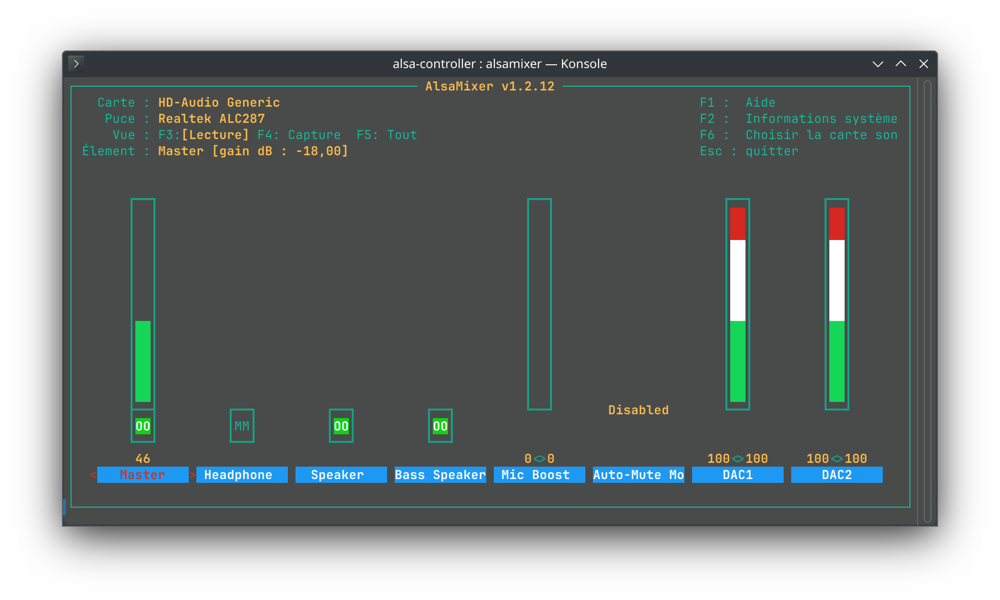

# Lenovo Yoga Slim 7 (14APU8) & Linux

How-to guide to get proper Linux support on the Lenovo Yoga Slim 7 (14APU8).

**Last update : 20/03/2025 (BIOS `M6CN44WW`)**


## Compatibility

| Component | Description | Status |
| --- | --- | --- |
| CPU | AMD Ryzen 7 7840S | ✅ Working OoB |
| GPU | AMD Radeon 780M | ⚠️ See [GPU](#gpu) |
| Memory | 16-32GB LPPDR5X | ✅ Working OoB |
| Storage | 512GB-1TB NVMe SSD | ✅ Working OoB |
| Display | 14" 2944x1840@90 OLED | ✅ Working OoB |
| WiFi | RTL8852CE | ✅ Working OoB |
| Bluetooth | RTL8852CU | ✅ Working OoB |
| Sound (Subwoofer) | TI 2781  | ✅ Working with **[custom firmware](#sound)** |
| Touchpad | Unknown | ✅ Working OoB |
| Camera | 720p | ✅ Working OoB |
| Suspend | - | ✅ Working with injected SSDT |
| Hibernate | - | ❌ Broken |
| Secure Boot | - | ⚠️ See [Secure Boot](#secure-boot) |
| IR Camera auth | 720p | ⚠️ See [Howdy](https://github.com/boltgolt/howdy)

## Notes

- If some updates are missing, feel free to open issues / PR.
- I'm not the maintener of the custom firmware / injected SSDT, if you have any problems related with them, open issues on their related repos.

## Suspend

Suspend will not work on fresh installation (the laptop instantly wakes up when closing the lid). See [this issue on GitLab](https://gitlab.freedesktop.org/drm/amd/-/issues/2812) for more details.
You will need to inject a custom injected SSDT to make it work and depending on your distro, it can be more or less tricky.

If your using Arch Linux, you can use the **[mkinitcpio's acpi_override hook](https://wiki.archlinux.org/title/DSDT#Using_mkinitcpio's_acpi_override_hook)**.

```bash
sudo mkdir /etc/initcpio/acpi_override
sudo cp ssdt6.aml /etc/initcpio/acpi_override/
```

then edit `/etc/mkinitcpio.conf` and add `acpi_override` to the `HOOKS` array.

```conf
HOOKS=(... acpi_override)
```

Then rebuild the initramfs with `sudo mkinitcpio -P` and reboot.

### Freeze on wake up

If your system crash when waking up from suspend sometimes, BIOS `M6CN42WW` and later fix this issue.
To update the BIOS without Windows, see [this section below](#updating-the-bios-without-a-windows-installation).

### Hibernation

**⚠️ This hasn't been tested in a while; it might have improved with the recent BIOS updates.**

Hibernation is still quite buggy on this system, see [this issue on GitLab](https://gitlab.freedesktop.org/drm/amd/-/issues/3047) for more details.
You should at least disable `suspend-then-hibernate` to prevent unexpected crashes, and disable hibernation completely if your not using this feature:

```bash
sudo nano /etc/systemd/sleep.conf
```

and edit it like this :

```conf
[Sleep]
AllowSuspend=yes
AllowHibernation=no
AllowSuspendThenHibernate=no
AllowHybridSleep=no
```

## Secure Boot

Because your using a custom injected SSDT, you will need to disable Secure Boot in your BIOS settings, otherwise the SSDT will not be loaded.

You can also sign the SSDT with your own keys to make it work with Secure Boot, but this is a more advanced topic and I will not cover it here.

## Sound

Sound needs a custom firmware to work properly.
See [this repo](https://github.com/darinpp/yoga-slim-7).

You can use `alsamixer` to adjust the sound levels of the subwoofers and the main speakers (DAC 1 & 2).


Sound will not be as good as on Windows (the 4 subwoofers are not calibrated precisely and Dolby Atmos spacial effect is missing.)

However, you can mitigate this with [Easy Effects](https://github.com/wwmm/easyeffects).
There is a preset that I made to improve the sound in the `easyeffect` folder (I'm not an expert so if you want to make a better one, do not forget to share it :) )

## Power profiles

On an Arch installation do not forget to install `power-profiles-daemon` to get control over power profiles.

## GPU

The Radeon 780M has some issues related to power profiles.
On a fresh installation, the GPU will have some artifacts on the screen using 90 Hz mode.
This cannot be fixed at the moment without forcing the GPU to run on a higher power profile.
Alternatively, you can use the 60 Hz mode, which will work without any issues.

## Updating the BIOS without a Windows installation

You can create a WINPE USB key with the BIOS update file.

### 1. Creating a WINPE USB key using Ventoy

If you don't have any Windows device, the simplest method is to use Ventoy to create a bootable USB key with WINPE.

1. Go to the [Ventoy website](https://www.ventoy.net/en/index.html) and download the latest version.
2. Flash the Ventoy image on the USB key or use the Ventoy tool to create a bootable USB key.
3. Copy a WINPE ISO on the Ventoy USB key (you can get one [here](https://www.osdcloud.com/sandbox/winpe-downloads))

### 2. Preparing the BIOS update file

1. Go to the [Lenovo website](https://pcsupport.lenovo.com/fr/fr/products/laptops-and-netbooks/yoga-series/yoga-slim-7-14apu8/downloads/driver-list/component?name=BIOS&id=5AC6A815-321D-440E-8833-B07A93E0428C) and download the latest BIOS update.
2. Move the BIOS update to a USB key. You can use the Ventoy USB key if you want.

Checking the checksum of the BIOS update is a good practice to avoid bricking your laptop.

### 3. Booting WINPE & updating the BIOS

1. Reboot the laptop and press `F12` to enter the boot menu
2. Select the USB key. If you don't see it, you may need to disable Secure Boot in the BIOS settings.
3. When a terminal is open, run `notepad`
4. Select `file > open file`
5. Select file type `all files`
6. Navigate to the BIOS update tool
7. Select the BIOS update tool, then right click on it and select `run`
8. Follow the instructions. Never turn off the laptop during the update process, even if you get a black screen.