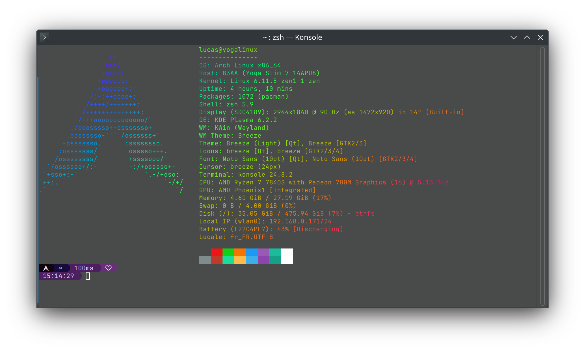

# Lenovo Yoga Slim 7 (14APU8) & Linux

Discussions & Tricks to improve Linux compatibility to the Lenovo Yoga Slim 7 (14APU8)



## Compatibility
| Component | Description | Status |
| --- | --- | --- |
| CPU | AMD Ryzen 7 7840S | ✅ Working OoB |
| GPU | AMD Radeon 780M | ⚠️ See [GPU](#gpu) |
| Memory | 16-32GB LPPDR5X | ✅ Working OoB |
| Storage | 512GB-1TB NVMe SSD | ✅ Working OoB |
| Display | 14" 2944x1840@90 OLED | ✅ Working OoB |
| WiFi | Intel AX200 | ✅ Working OoB |
| Bluetooth | Intel AX200 | ✅ Working OoB |
| Sound (Subwoofer) | TI 2781  | ✅ Working with **[custom firmware](##Sound)** |
| Touchpad | Unknown | ✅ Working OoB |
| Camera | 720p | ✅ Working OoB |
| Suspend | - | ✅ Working with injected SSDT |
| Hibernate | - | ❌ Broken |
| Secure Boot | - | ⚠️ See [Secure Boot](#secure-boot) |
| IR Camera auth | 720p | ⚠️ See [Howdy](https://github.com/boltgolt/howdy)

## Things to know

- All commands have been tested on an updated Arch Linux installation the 28/10/2024.
- Most of the issues are related to poorly written BIOS by Lenovo. Lenovo seems to have dropped support for this device as the latest BIOS version is from 15/12/2023.
- Feel free to open issues with your own Linux experience with this laptop.
- I'm not the maintener of the custom firmware / injected SSDT, if you have any problems related with them, open issues on their related repos.

## Suspend

Suspend will not work on fresh installation (the laptop instantly wakes up when closing the lid). See [this issue on GitLab](https://gitlab.freedesktop.org/drm/amd/-/issues/2812).
You will need to inject a custom injected SSDT to make it work and depending on your distro, it can be tricky.

If your using Arch Linux, you can use the **[mkinitcpio's acpi_override hook](https://wiki.archlinux.org/title/DSDT#Using_mkinitcpio's_acpi_override_hook)**.

```bash
sudo mkdir /etc/initcpio/acpi_override
sudo cp ssdt6.aml /etc/initcpio/acpi_override/
```

then edit `/etc/mkinitcpio.conf` and add `acpi_override` to the `HOOKS` array.

```conf
HOOKS=(... acpi_override)
```

then rebuild the initramfs with `sudo mkinitcpio -P`.

### Freeze on wake up

This issue is related to the GPU, see **GPU** below.

### Hibernation

Hibernation is still quite buggy on this system, see [this issue on GitLab](https://gitlab.freedesktop.org/drm/amd/-/issues/3047).
You should at least disable `suspend-then-hibernate` to prevent unexpected crashes, and disable hibernation completely if your not using this feature:

```bash
sudo nano /etc/systemd/sleep.conf
```

and edit it like this :

```conf
[Sleep]
AllowSuspend=yes
AllowHibernation=no
AllowSuspendThenHibernate=no
AllowHybridSleep=no
```

## Secure Boot

Because your using a custom injected SSDT, you will need to disable Secure Boot in your BIOS settings, otherwise the SSDT will not be loaded.

You can also sign the SSDT with your own keys to make it work with Secure Boot, but this is a more advanced topic and I will not cover it here.

## Sound

Sound needs a custom firmware to work properly.
See [this repo](https://github.com/darinpp/yoga-slim-7).
Sound will not be as good as on Windows (the 4 subwoofers are not calibrated precisely and Dolby Atmos spacialization effect is missing.)

However, this can be partially mitigated with [Easy Effects](https://github.com/wwmm/easyeffects).

## Power profiles

On an Arch system do not forget to install `power-profiles-daemon` to get control on power profiles.

## GPU

Depending on your power profile the GPU will crash and freeze your entire system when trying to wake up from suspend. It seems that if system is using "Performance Mode" ("Maximum Performance" in BIOS), the issue will not occurred.

Also, the GPU seems to have rare buffer issues related to power profiles (same here, using "Performance Mode" seems to have less artifacts than other modes).

### Dirty script to switch power profiles
